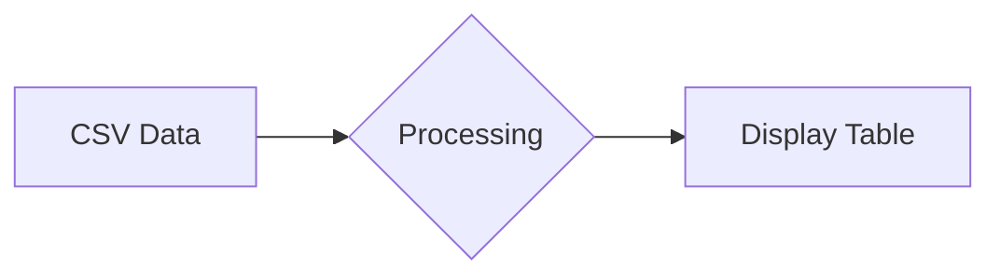

# test

```csv
Header1,Header2,Header3
Data1,Data2,Data3
Data4,Data5,Data6
```


### 3. 通过 HTML 嵌入（GitHub 支持）
```html
<table>
  <tr><th>Header1</th><th>Header2</th></tr>
  <tr><td>Data1</td><td>Data2</td></tr>
</table>


