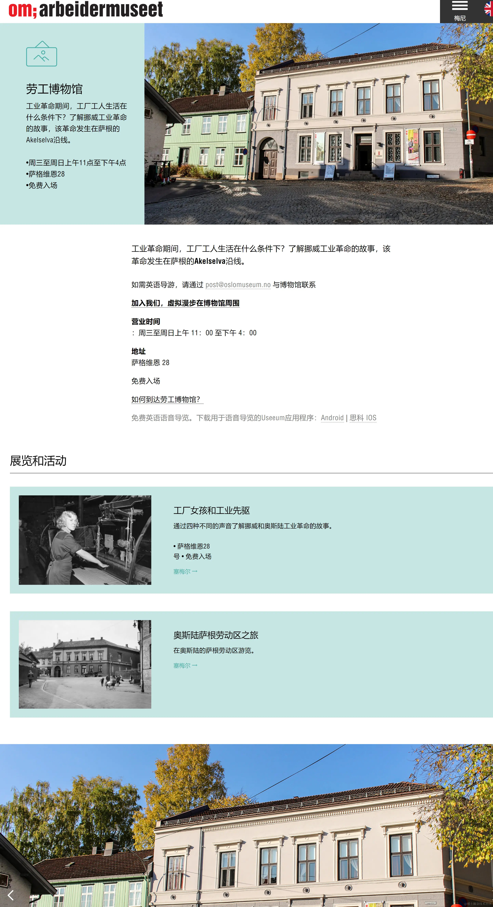
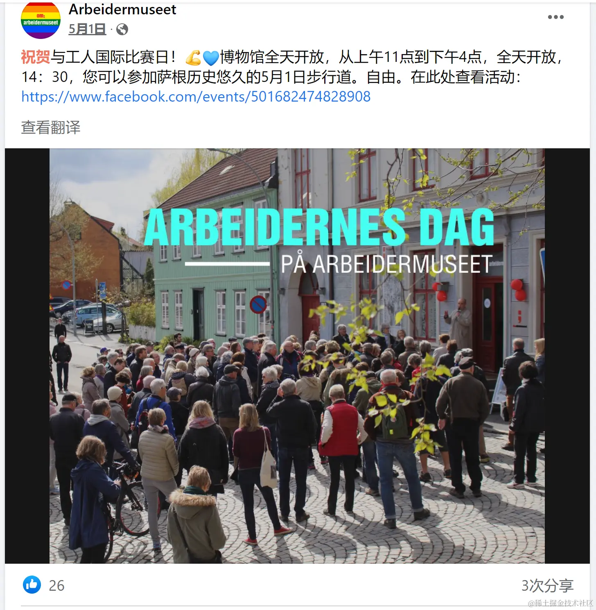

挪威奥斯陆的劳动博物馆

&emsp;&emsp;2014年我因出差去挪威首都奥斯陆，看到政府官方的旅游手册还有劳动博物馆，就觉得挺有趣 - 一个资本主义国家还建一个劳动博物馆,还去实地逛了逛.和现在中国很多城市一样,曾经的工厂片区改成了创意产业区,这就是创意区的一栋小楼，但是展览得挺精致，介绍当地的工业发展起源和伴随其中的劳动人民争取权益等等历史图片，印象很深刻，比如有个木盒子道具，里面放着一个红色的手指尖模型，讲的是因为工厂劳动环境缺乏防护措施，导致工人手指被切下，指的是资本主义“血淋淋的原始积累”。

&emsp;&emsp;没有争取就不会有权益，欧洲很多国家为什么劳动环境好，不像中国的996等等？因为欧洲各国普遍有很多社会主义性质政党，他们信奉的是恩格斯主义，即通过议会斗争来争取劳动者的权益，而不是共产-party的武力夺取政权,这类政党一般是工党，社民党等，有的执政党，有的在野党，还有工会组织罢工，所以资本家不敢肆意剥削罢了.

&emsp;&emsp;以前对资本主义/社会主义/共产主义懵懵懂懂,看过一些高晓松的节目,加上去了一些国家,和一些人聊天,慢慢懂了一些道理.

