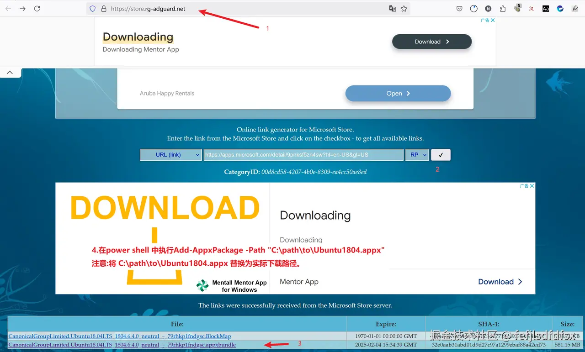
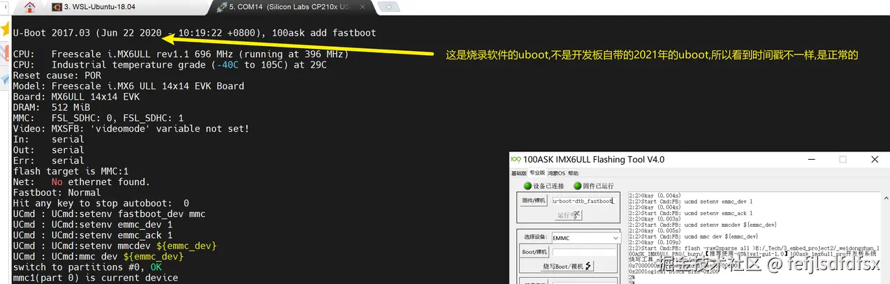
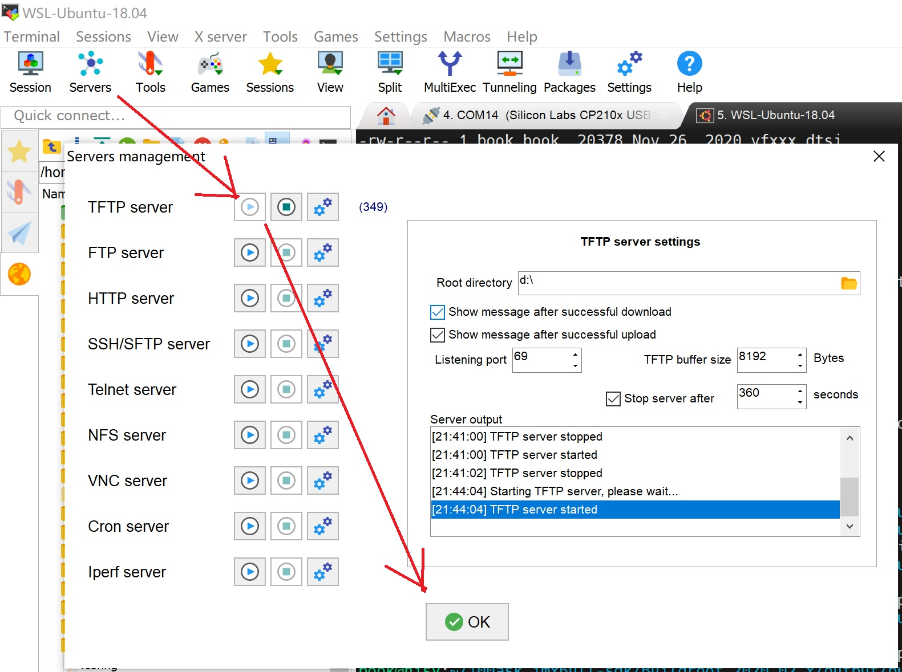
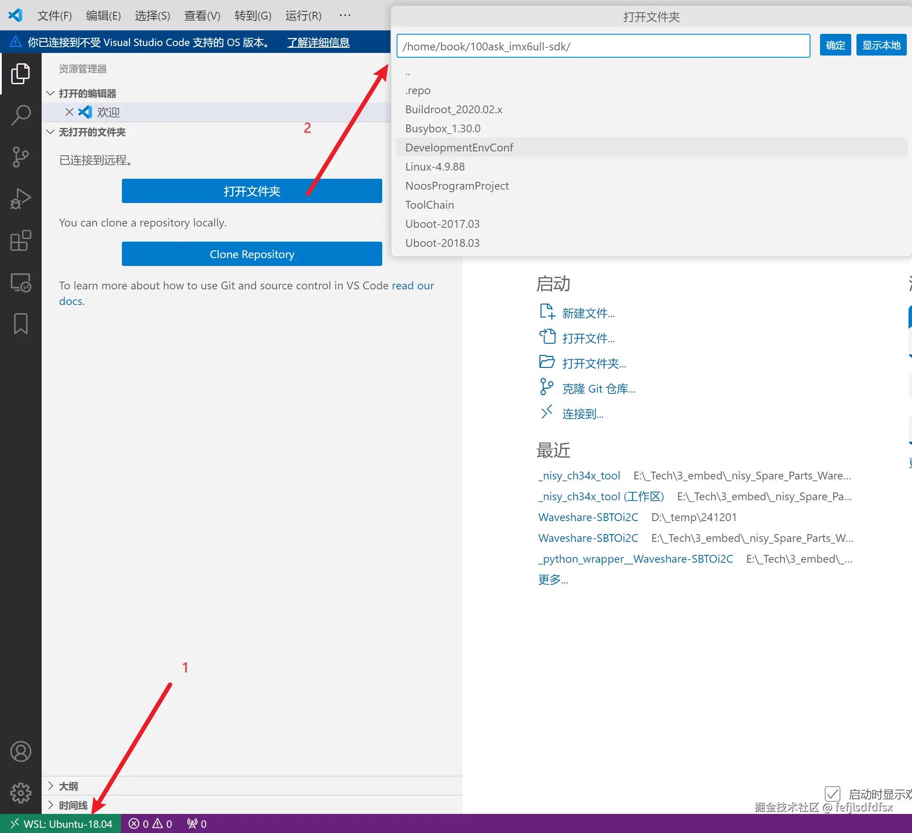

[toc]

# 使用wsl2搭建韦东山imx6ull pro开发板的开发环境

&#x20;  现在linux开发环境一般比较复杂,以韦东山的imx6ull pro开发板为例,需要使用vmware运行虚拟机,然后打通 开发板<->虚拟机<->windows桌面这3者的互通,导致很复杂.本文通过wsl2编译镜像,去掉vmware环境,开发板只从windows桌面传递文件,减少环境的复杂性.开发板和windows桌面的连接是参考《嵌入式Linux应用开发完全手册V5.2\_IMX6ULL\_Pro开发板.pdf》的《第四 A 章 使用 USB 网卡直连配置网络》方法.

注:因为开发板又有emmc,又有sd卡,并且烧sd卡时需要先上电再拔卡,导致容易混乱,我是直接放弃使用sd卡,只使用emmc.

## 安装wsl2的ubuntu 18.04版本

为了保持环境的一致性,还是需要安装ubuntu 18.04.我在微软store下载wsl的ubuntu18.04直接闪退,后来了解到在  [https://store.rg-adguard.net/](https://link.zhihu.com/?target=https%3A//store.rg-adguard.net/) 可以下载商店的软件包,然后用如下图中 1\~3步下载:



第4步:在powershell中安装下载的.appx的离线包:

```

Add-AppxPackage -Path "C:\path\to\Ubuntu1804.appx"
注意:将 C:\path\to\Ubuntu1804.appx 替换为实际下载路径。

```

因为把ubuntu 18.04 后续编译buildroot导致会占用C盘空间太多,所以一开始就转到E盘,参考如下:

```shell
PS C:\Users\nisy_tc> wsl --shutdown
PS C:\Users\nisy_tc> wsl --export Ubuntu-18.04 D:\_temp\ubuntu-18.04.tar
正在导出，这可能需要几分钟时间。...: ./var/lib/lxd/unix.socket: pax format cannot archive sock
操作成功完成。
PS C:\Users\nisy_tc> wsl --unregister Ubuntu-18.04
正在注销。
操作成功完成。
PS C:\Users\nisy_tc> wsl --import Ubuntu-18.04 E:\_wsl_ubuntu18.04 D:\_temp\ubuntu-18.04.tar
正在导入，这可能需要几分钟时间。
操作成功完成。
PS C:\Users\nisy_tc>

```

## wsl2的ubuntu 18.04中下载100ask_imx6ull-sdk 和编译Buildroot
### 下载100ask_imx6ull-sdk代码
启动ubunut 18.04后,添加book账户:

```shell
sudo useradd -m -s /bin/bash book
sudo passwd book                  ##输入密码123456
sudo usermod -aG sudo book
```

按照<嵌入式Linux应用开发完全手册V5.2\_IMX6ULL\_Pro开发板.pdf> 文档的<2.2 安装 Ubuntu 软件 >章节:

```shell
git clone https://e.coding.net/weidongshan/DevelopmentEnvConf.git
cd DevelopmentEnvConf  
sudo ./Configuring_ubuntu.sh
```

配置git

```shell
git config --global user.email "user@100ask.com"
git config --global user.name "100ask"
```

<2.6.2 下载 BSP >章节执行如下命令:

```shell
book@100ask:~$ git clone https://e.coding.net/codebug8/repo.git 
book@100ask:~$ mkdir -p 100ask_imx6ull-sdk && cd 100ask_imx6ull-sdk  
book@100ask:~/100ask_imx6ull-sdk$ ../repo/repo init -u https://gitee.com/weidongshan/manifests.git -b linux-sdk -m imx6ull/100ask_imx6ull_linux4.9.88_release.xml  --no-repo-verify
book@100ask:~/100ask_imx6ull-sdk$  ../repo/repo sync -j4
```

但是我这里repo init 出现报错:"repo: error: unknown branch "master"",所以安装了国内源的repo,再重新repo init后就可以了:

```sql
git clone https://mirrors.tuna.tsinghua.edu.cn/git/git-repo
../git-repo/repo init -u https://gitee.com/weidongshan/manifests.git -b linux-sdk -m imx6ull/100ask_imx6ull_linux4.9.88_release.xml --no-repo-verify
```

编写环境变量的脚本` _nisy_setup_environment.sh`,内容如下:
```
export ARCH=arm
export CROSS_COMPILE=arm-buildroot-linux-gnueabihf-
export PATH=$PATH:/home/book/100ask_imx6ull-sdk/ToolChain/arm-buildroot-linux-gnueabihf_sdk-buildroot/bin
```

执行`source  ./_nisy_setup_environment.sh` 命令使其生效.

### buildroot套件的全编译

下面以100ask\_imx6ull\_pro\_ddr512m\_systemV\_qt5\_defconfig配置文件为例，在ubuntu终端上说明 Buildroot 的配置过程,在
`~/100ask_imx6ull-sdk/Buildroot_2020.02.x`
路径下：
```
make clean
make 100ask_imx6ull_pro_ddr512m_systemV_qt5_defconfig 
make all
```
注：其中buildroot支持的配置如下：
```
book@100ask:~/100ask_imx6ull-sdk/Buildroot_2020.02.x$  make list-defconfigs
Built-in configs:
  100ask_imx6ull_mini_ddr512m_systemV_core_defconfig - Build for 100ask_imx6ull_mini_ddr512m_systemV_core
  100ask_imx6ull_mini_ddr512m_systemV_qt5_defconfig - Build for 100ask_imx6ull_mini_ddr512m_systemV_qt5
  100ask_imx6ull_pro_ddr512m_systemV_core_defconfig - Build for 100ask_imx6ull_pro_ddr512m_systemV_core
  100ask_imx6ull_pro_ddr512m_systemV_qt5_defconfig - Build for 100ask_imx6ull_pro_ddr512m_systemV_qt5
  100ask_stm32mp157_pro_ddr512m_busybox_core_defconfig - Build for 100ask_stm32mp157_pro_ddr512m_busybox_core
....
  qemu_aarch64_virt_defconfig         - Build for qemu_aarch64_virt
  qemu_arm_versatile_defconfig        - Build for qemu_arm_versatile
  qemu_arm_versatile_nommu_defconfig  - Build for qemu_arm_versatile_nommu
  qemu_arm_vexpress_defconfig         - Build for qemu_arm_vexpress
  qemu_arm_vexpress_tz_defconfig      - Build for qemu_arm_vexpress_tz
......
  raspberrypi0_defconfig              - Build for raspberrypi0
  raspberrypi0w_defconfig             - Build for raspberrypi0w
  raspberrypi2_defconfig              - Build for raspberrypi2
  raspberrypi3_64_defconfig           - Build for raspberrypi3_64
  raspberrypi3_defconfig              - Build for raspberrypi3
  raspberrypi3_qt5we_defconfig        - Build for raspberrypi3_qt5we
  raspberrypi4_64_defconfig           - Build for raspberrypi4_64
  raspberrypi4_defconfig              - Build for raspberrypi4
  raspberrypi_defconfig               - Build for raspberrypi
  .......
```
### 在 buildroot 下进入 menuconfig 包选择配置配置界面

```
book@100ask: ~/100ask_imx6ull-sdk/Buildroot_2020.02.x$ make menuconfig
```

### buildroot 下单独编译 u-boot

```
book@100ask: ~/100ask_imx6ull-sdk/Buildroot_2020.02.x$ make uboot-rebuild 
```

### buildroot 下单独编译内核+dtb

在
`/home/book/100ask_imx6ull-sdk/Buildroot_2020.02.x/output/build/linux-headers-origin_master`

路径下
```
find . -iname *.o|xargs rm -rf *.o
make mrproper
make 100ask_imx6ull_defconfig
make zImage  -j4
cp arch/arm/boot/zImage  /home/book/100ask_imx6ull-sdk/Buildroot_2020.02.x/output/images/
```

同理编译dtb:
```
make 100ask_imx6ull_defconfig
make dtbs
cp arch/arm/boot/dts/100ask_imx6ull-14x14.dtb  /home/book/100ask_imx6ull-sdk/Buildroot_2020.02.x/output/images/

```

book@100ask: ~/100ask_imx6ull-sdk/Buildroot_2020.02.x$ make linux-rebuild    //存疑，似乎仅仅是重新打包了zImage

### buildroot 下进入内核 make menuconfig 配置选项界面

```
book@100ask: ~/100ask_imx6ull-sdk/Buildroot_2020.02.x$ make linux-menuconfig 
```
### buildroot 下单独编译某个软件包

```
book@100ask: ~/100ask_imx6ull-sdk/Buildroot_2020.02.x$ make <pkg>-rebuild 
```
### buildroot 下进入 busybox 配置界面

```
book@100ask: ~/100ask_imx6ull-sdk/Buildroot_2020.02.x$ make busybox-menuconfig 
```

buildroot 下生成系统 sdk,最后生成的目录在 output/images/目录下
```
book@100ask: ~/100ask_imx6ull-sdk/Buildroot_2020.02.x$ make sdk 
```

### buildroot 下检查文件系统是否真正重编译

可以在这个文件中做标记：
```
vi /home/book/100ask_imx6ull-sdk/Buildroot_2020.02.x/board/100ask/nxp-imx6ull/rootfs-overlay/systemV/etc/issue 
```
烧入单板后，检查登陆后，是否有自己标记的字符串。

### Buildroot的输出路径
执行Buildroot 后,编译成功后文件输出路径为 output/images :

```sql
buildroot2020.02.x  
  ├── output
    ├── images  
      ├── 100ask_imx6ull-14x14.dtb <--设备树文件  
      ├── rootfs.ext2         <--ext2 格式根文件系统
      ├── rootfs.ext4 -> rootfs.ext2    <--ext2 格式根文件系统  
      ├── rootfs.tar          
      ├── rootfs.tar.bz2       <--打包并压缩的根文件系统，用于NFSROOT 启动
      ├── 100ask-imx6ull-pro-512d-systemv-v1.img      <--完整的系统镜像(可以用来烧写 emmc 和 sd 卡)
      ├── u-boot-dtb.imx       <--u-boot 镜像
      └── zImage          <--内核镜像
```


## [升级]整体升级

wsl编译的100ask-imx6ull-pro-512d-systemv-v1.img 直接拷贝到windows桌面的E盘,即wsl2的 `/mnt/e/`,然后按照<嵌入式Linux应用开发完全手册V5.2\_IMX6ULL\_Pro开发板.pdf>文档的描述:

    可以参考章节《烧写整个系统或更新部分系统》把上面编译出来的 100ask-imx6ull-pro-512d-systemv-v1.img 重命名为 emmc.img(或 sdcard.img)，把 emmc.img(或 sdcard.img)放到“100ask\_imx6ull 烧写工具”的 files 目录里，就可以使用工具烧写到 EMMC(或 SD/TF卡)。

注意:

*   100ask\_imx6ull\_flashing\_tool\_v4.0.exe  不要在有空格或者标点符号的路径下运行
*   Usb otg口升级时,需要直连电脑,不能经过usb hub



## [升级]只升级zImage+dtb

按照100ask手册的配置,电脑的IP默认 `192.168.5.10` , 开发板的IP默认是`192.168.5.9`,先配置IP后确认能ping通.

把wsl2的ubuntu的zImage 拷贝到window的D盘:
```
cd /home/book/100ask_imx6ull-sdk/Buildroot_2020.02.x/output/build/linux-headers-origin_master
cp arch/arm/boot/zImage  /mnt/d
cp arch/arm/boot/dts/100ask_imx6ull-14x14.dtb  /mnt/d
```
打开mobaxterm的tftp服务器:



把zImage和dtb从windows桌面传到开发板的/boot下,然后重启即一直就生效了:
```
[root@imx6ull:/sys]# cd /boot
[root@imx6ull:/boot]# ls -al
total 7282
drwxr-xr-x    2 root     root          1024 Jun  3  2020 .
drwxr-xr-x   24 root     root          1024 Jan  1 00:00 ..
-rw-r--r--    1 root     root         38370 Jun  3  2020 100ask_imx6ull-14x14.dtb
-rw-r--r--    1 root     root         36885 Jun  3  2020 100ask_myir_imx6ull_mini.dtb
-rw-r--r--    1 root     root       7377264 Jun  3  2020 zImage
[root@imx6ull:/boot]# uname -a
[root@imx6ull:/boot]# mv zImage  zImage_20200603  # 备份原始的zImage
[root@imx6ull:/boot]# tftp -gr zImage 192.168.5.10
[root@imx6ull:/boot]# sync

```

注:tftp命令的使用格式如下:
```
//从对方IP地址接收文件
tftp -gr 文件名 对方IP地址

//向对方IP地址发送文件
tftp -pr 文件名 对方IP地址
```
注:内核和设备树文件放在同一个分区 /boot 中，而不是单独的磁盘分区(PC上的Linux常将`/boot`设为独立分区),是为了简化系统启动和管理。


## 在windows下浏览wsl2里的代码

通过ssh插件,操作如下:



## 我的挂载移动硬盘到wsl2,并在wsl2中编译移动硬盘的代码的流程

1.打开 wsl2 的ubuntu 20.04系统
2.插入我的移动硬盘,"以管理员身份运行"打开power shell,执行`_nisy_load_1st_m2_disk.bat`, 其内容如下:

```
PS C:\WINDOWS\system32> cat .\_nisy_load_1st_m2_disk.bat
::_nisy_load_1st_m2_disk
usbipd unbind --hardware-id 0bda:9210
usbipd bind --force --hardware-id 0bda:9210
usbipd attach --wsl --hardware-id 0bda:9210
PS C:\WINDOWS\system32>
```

3.在wsl2的ubuntu 20.04中,挂载移动硬盘:
